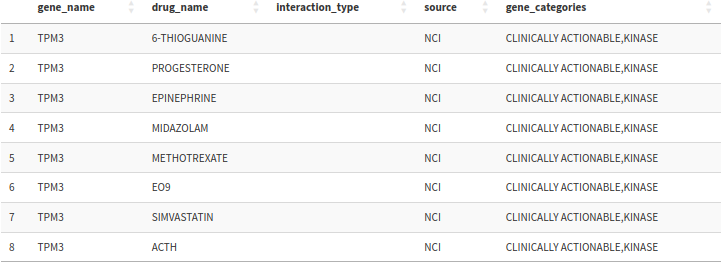
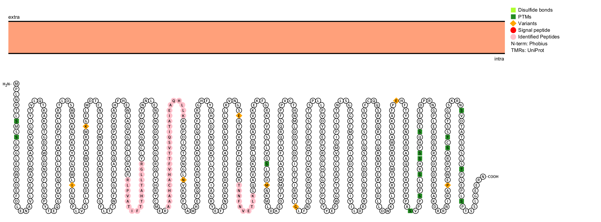

# Interpret the result

## PCA

PCA plot is a good way to inspect your result regarding batch effect and reproducibility of replicates. One limitation of PCA is that only full observed proteins (may by imputation) are included in the PCA.  

## Missing Value Heatmap

Missing value heatmap shows the missing value pattern of samples. Note that only protein with missing values are shown in the heatmap.

## Correlation Heatmap

Correlation heatmap shows the correlation matrix between samples. Typically, you should see samples in the same condition clustered together.

## Coefficient of Variation Plot

Coefficient of variation plot shows distribution of protein level coefficient of variation for each condition. Each plot also contains a vertical line representing median CVs percentage within that condition. Low coefficient of variation means the spread of data values is low relative to the mean.

## t-Distributed Stochastic Neighbor Embedding

t-SNE performs unsupervised non-linear dimentionality reduction, well suited for high-dimensional datasets. The goal is to 
reveal local clusters and using (computationally intensive) pairwise distance calculations. It is primarily used for visualization and is less suitable for extracting meaningful feature representations.

## Enrichment Result

Enrichment analysis gives you a rough idea of changes between two different conditions. Our enrichment analysis is based on [Enrichr](https://maayanlab.cloud/Enrichr/) with background correction through hypergeometric test.

## Protein-Protein Interaction Network

## Drug Interaction Prediction

Drug-Gene interaction prediction using the [DGIdb](https://www.dgidb.org/) database. 

## Protter Visualization

Visualization and annotation of a wanted protein structure using [Protter](http://wlab.ethz.ch/protter/). In the peptide
pipeline, all of the identified peptides are annotated. 
